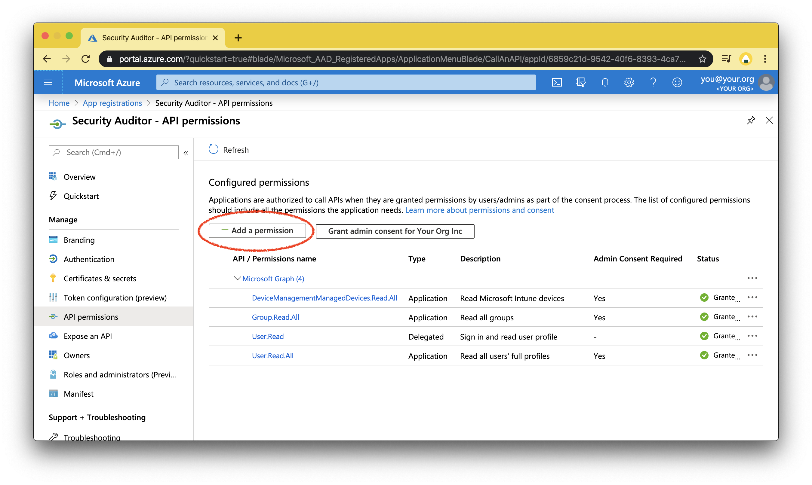

# Azure Inventory and Configuration Connector Tutorial

In order for the Connector to ingest Configuration and Inventory, you first need to create the Azure Application in the [Applications List Blade](https://portal.azure.com/?quickstart=true#blade/Microsoft_AAD_RegisteredApps/ApplicationsListBlade)

And generate a Client secret for the application you've created:

Once that is done, you have enough to start running the connector, but before it records your inventory and configuration, not just access errors, we'll need to grant it some permissions.

### Grant Reader Role

On the IAM page of your Subscription, create a new Role assignment:

And add the Reader role to your Security Auditor application:

### Grant Graph API permissions

Add the following permissions in the [AD Blade](https://portal.azure.com/?quickstart=true#blade/Microsoft_AAD_IAM/ActiveDirectoryMenuBlade/RegisteredApps) > Security Auditor > API Permissions

Then, verify and grant the permissions in the [App Blade](https://portal.azure.com/?quickstart=true#blade/Microsoft_AAD_IAM/StartboardApplicationsMenuBlade) > Security Auditor > Permissions

You are done creating basic permissions and can now query most the tables listed in

~~~
SHOW TABLES LIKE 'azure\\_collect\\_%' IN SCHEMA data;
~~~

For your AWS Inventory and Configurations data.

### Advanced Grants

These described permissions alone may not populate some data, e.g. Vault Secrets and Vault Keys. Please reach out to us if you need assistance with setting these up at [snowalert@snowflake.com](mailto:snowalert@snowflake.com).
